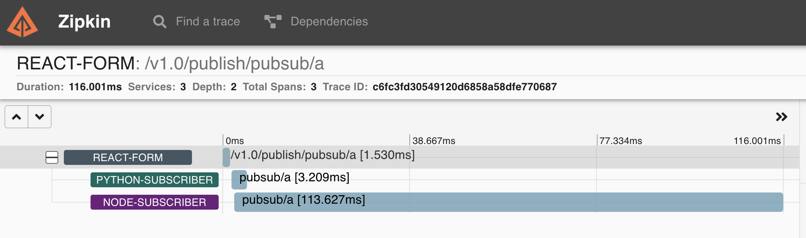

# Hands-on with Dapr Quickstart

The purpose of this repo is to help you quickly get hands-on with Dapr. It is meant to be consumed either through GitHub codespaces or through a local Dev Container. The idea being that everything you need from tooling to runtimes is already included in the Dev Container so it should be as simple as executing a run command.

* **Date:** 8th November 2021
* **Squad:** Cloud Native
* **Duration:** 30 minutes

## Pre-requisites

For this demo we will be using the Dapr project's [quickstarts](https://github.com/dapr/quickstarts) repo. We'll focus on the [pub-sub](https://github.com/dapr/quickstarts/tree/master/pub-sub) quickstart, which demonstrates how to use Dapr to enable pub-sub applications using Redis as a pub-sub component.

There are two options:

1. [Access to GitHub Codespaces](#getting-started-via-codespaces)
1. [VS Code + Docker Desktop on Local Machine](#getting-started-via-vs-code-and-local-dev-container)

## Getting Started via Codespaces

1. In a new tab, navigate to https://github.com/dapr/quickstarts.

    > If you don't have access to GitHub Codespaces, follow the guide [here](./vs-code-locally.md) to get started using [Dev Containers](https://code.visualstudio.com/docs/remote/containers) locally.  

1. If you would like to jump in right away by using GitHub Codespaces, you can click on "Code" in this repo, select "Codespaces" and click "New Codespace", which will let you get started right away with ```dapr init```.

    > GitHub Codespaces will provide you a Visual Studio Code based editor backed by high performance VMs in the cloud. It will take a moment for GitHub to create your dev space. This does the following:
    >
    > - Build a container image based on the [Dockerfile](https://github.com/dapr/quickstarts/blob/v1.4.0/.devcontainer/Dockerfile). 
    > - Create a dev container based on [devcontainer.json](https://github.com/dapr/quickstarts/blob/v1.4.0/.devcontainer/devcontainer.json).
    > - Configure this container, and your dev environment as per the provided config. 

## Getting Started via VS Code and Local Dev Container

Just an FYI that this process will take some time as it involved downloading a base container image and then buiding a container image using the Dockerfile in the **.devcontainer** folder.

1. Clone the https://github.com/dapr/quickstarts repo to your local machine and then open it in VS Code.

1. Once the repo is cloned and opened up with VS Code on your local machine, you should get a **Reopen in Container** option in the lower right-hand corner of VS Code. In case you missed it, youc an also go to the VS Code **Command Palette** and type in **remote-containers: Reopen in Container**.


## Exploring Pub-Sub

We will explore Pub-Sub through a story. Imagine you have an application that needs to publish an event so that one or more subscribers could respond to that event. Those subscribers are independent of one another, are written in different languages, and there is a need to observe how those events flow between all of the services.

Through exploring the steps below you will see how to create a React Form that publishes events to a topic via a simple UI. How two subscribers, one in Node, and one in Python, process those events. Then we will wrap-up by seeing how Dapr ties the flow of those messages together through the power of Open Telemetry.

Visit [this](https://docs.dapr.io/developing-applications/building-blocks/pubsub/) link for more information about Dapr and Pub-Sub.

This quickstart includes one publisher:

- React front-end message generator [[source](https://github.com/dapr/quickstarts/tree/master/pub-sub/react-form)]

And two subscribers: 
 
- Node.js subscriber [[source](https://github.com/dapr/quickstarts/tree/master/pub-sub/node-subscriber)]
- Python subscriber [[source](https://github.com/dapr/quickstarts/tree/master/pub-sub/python-subscriber)]

Dapr uses pluggable message buses to enable pub-sub, and delivers messages to subscribers in a [Cloud Events](https://github.com/cloudevents/spec) compliant message envelope. in this case you'll use Redis Streams. The following architecture diagram illustrates how components interconnect locally:


### Running the Pub-Sub Quickstart

In order to run the pub/sub quickstart locally, each of the microservices need to run with Dapr. This involves initializing Dapr, starting the message subscribers, and then starting the message publisher.

### Get familiar with the code

1. **Optional:** It's worth taking a moment to understand how the solution is imlemented using the Dapr [building block](https://docs.dapr.io/developing-applications/building-blocks/pubsub/pubsub-overview/):

    * [react-form/server.js](https://github.com/dapr/quickstarts/blob/master/pub-sub/react-form/server.js#L19-L24) - emitting events
    * [node-subscriber/app.js](https://github.com/dapr/quickstarts/blob/master/pub-sub/node-subscriber/app.js#L15-L28) - programmatic event subscription in Node.js
    * [python-subscriber/app.py](https://github.com/dapr/quickstarts/blob/master/pub-sub/python-subscriber/app.py#L15-L18) - programmatic event subscription in Python

### Running Locally

#### Initialize Dapr

1. Once your Codespace or Dev Container is ready. Open the Terminal and run ```dapr init```. Dapr runs as a sidecar alongside your application, and in self-hosted mode this means it is a process on your local machine. Therefore, initializing Dapr includes fetching the Dapr sidecar binaries and installing them locally. Find out more [here](https://docs.dapr.io/getting-started/install-dapr-selfhost/).

    ```bash
    dapr init
    ```

#### Run Node message subscriber with Dapr

1. Navigate to Node subscriber directory in your CLI:

    ```bash
    cd pub-sub\node-subscriber
    ```

1. Install dependencies: 

    ```bash
    npm install
    ```

1. Run the Node subscriber app with Dapr: 

    ```bash
    dapr run --app-id node-subscriber --app-port 3000 node app.js
    ```

    > `app-id` which can be any unique identifier for the microservice. `app-port`, is the port that the Node application is running on. Finally, the command to run the app `node app.js` is passed last.

#### Run Python message subscriber with Dapr

1. Open a **new** CLI window and navigate to Python subscriber directory in your CLI: 

    ```bash
    cd pub-sub/python-subscriber
    ```

1. Install dependencies: 

    ```bash
    pip3 install -r requirements.txt 
    ```

1. Run the Python subscriber app with Dapr: 

    ```bash
    dapr run --app-id python-subscriber --app-port 5000 python3 app.py
    ```

#### Run the React front end with Dapr

Now, run the React front end with Dapr. The front end has a UI that will help you publish different kinds of messages that subscribers will be able to pick up.

1. Open a new CLI window and navigate to the react-form directory:

    ```bash
    cd pub-sub/react-form
    ```

1. Run the React front end app with Dapr: 

    ```bash
    npm run buildclient
    npm install
    dapr run --app-id react-form --app-port 8080 --dapr-http-port 8081 npm run start
    ```

    > This may take a minute, as it downloads dependencies and creates an optimized production build. You'll know that it's done when you see `== APP == Listening on port 8080!` and several Dapr logs.

1. When leveraging Dev Containers there is a port forwarding feature to give you access to TCP ports running within your environment. Go to **Ports** under the text editor.

1. Under the list of ports, find "8080" and open the "Local Address" in a new tab. You should see a form with a dropdown for message type and message text.


1. Pick a topic, enter some text and fire off a message! Observe the logs coming through your respective Dapr subscriber.

> Note that the Node.js subscriber receives messages of type "A" and "B", while the Python subscriber receives messages of type "A" and "C". Note that logs are showing up in the console window where you ran each one: 
> ```bash
> == APP == Listening on port 8080!
> ```

#### Use the CLI to publish messages to subscribers

The Dapr CLI provides a mechanism to publish messages for testing purposes.

1. Open a new CLI window, use Dapr CLI to publish a message:

    ```bash
    cd pub-sub
    dapr publish --publish-app-id react-form --pubsub pubsub --topic A --data-file message_a.json
    ```

1. You can also publish a message directly to the React Form app.

    > **Note:** If you are running in an environment without easy access to a web browser, the following curl commands will simulate a browser request to the node server.

    ```bash
    curl -s http://localhost:8080/publish -H Content-Type:application/json --data @message_b.json
    curl -s http://localhost:8080/publish -H Content-Type:application/json --data @message_c.json
    ```

1. You can also publish a message directly using the Dapr API, **also known as Service Invocation**, and notice the **8081** port number which maps to the --dapr-http-port used above.

    ```bash
    curl -s http://localhost:8081/v1.0/invoke/react-form/method/publish -H Content-Type:application/json --data @message_a.json
    curl -s http://localhost:8081/v1.0/invoke/react-form/method/publish -H Content-Type:application/json --data @message_b.json
    curl -s http://localhost:8081/v1.0/invoke/react-form/method/publish -H Content-Type:application/json --data @message_c.json
    ```

### Going one step further with Observability

One of Dapr's building blocks is Telemetry and it uses the Open Telemetry API to do this. As part of the default Dapr initialization a Zipkin pod is created and all Open Telemetry information is forwarded to that Pod. Let's see what this looks like.

1. Under the list of ports, find "9411" and open the "Local Address" in a new tab. You should see the Zipkin dashboard.


1. Click on the **Run Query** in the top right to see a recent list of traces. Find one that has 3 spans and then click on the **Show** button.



1. Applications launched with `dapr run` will by default reference the config file in `$HOME/.dapr/config.yaml` or `%USERPROFILE%\.dapr\config.yaml`.

    ```yaml
    apiVersion: dapr.io/v1alpha1
    kind: Configuration
    metadata:
      name: daprConfig
      namespace: default
    spec:
      tracing:
        samplingRate: "1"
        zipkin:
          endpointAddress: "http://localhost:9411/api/v2/spans"
    ```

1. Open the [ZipKin](https://zipkin.io/) UI. In your codespace, under the text editor, click "Ports". Under the list of ports, find "9411" and open the "Local Address" in a new tab.

1. Click "Run query". Zipkin will present a list of recent results. Find a trace that is routed by "react-form" and select "Show".


1. Zipkin will render the end-to-end trace. Starting with the React app emitting the event, and ending with the two subscribers processing the it.

#### Cleanup

1. Get Dapr to stop all the running application:

    ```bash
    dapr stop --app-id node-subscriber
    dapr stop --app-id python-subscriber
    dapr stop --app-id react-form
    ```

## Acknowledgements

* This demo is based on Dapr's [Pub-Sub quickstart](https://github.com/dapr/quickstarts/tree/v1.4.0/pub-sub).

## Contributors

* Kevin Harris - kevin.harris@microsoft.com
* Liam Moat - liam.moat@microsoft.com
* Anu Bhattacharya - anulekha.bhattacharya@microsoft.com
* Gordon Byers - gobyers@microsoft.com
